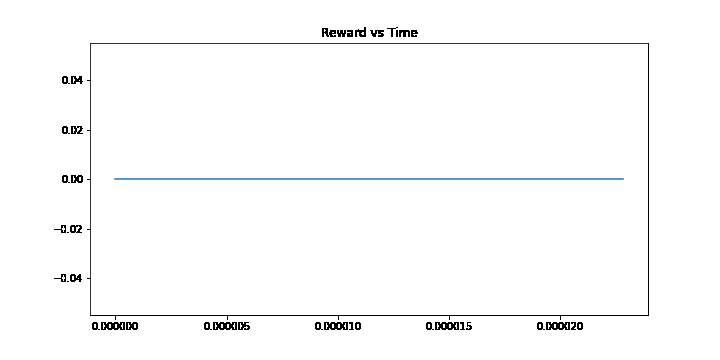

# Deep RL Quadcopter Controller

_Teach a Quadcopter How to Fly!_

In this project, you will design an agent to fly a quadcopter, and then train it using a reinforcement learning algorithm of your choice!

## Project Overview

The Quadcopter or Quadrotor Helicopter is becoming an increasingly popular aircraft for both personal and professional use. Its maneuverability lends itself to many applications, from last-mile delivery to cinematography, from acrobatics to search-and-rescue.

Most quadcopters have 4 motors to provide thrust, although some other models with 6 or 8 motors are also sometimes referred to as quadcopters. Multiple points of thrust with the center of gravity in the middle improves stability and enables a variety of flying behaviors.

But it also comes at a price–the high complexity of controlling such an aircraft makes it almost impossible to manually control each individual motor's thrust. So, most commercial quadcopters try to simplify the flying controls by accepting a single thrust magnitude and yaw/pitch/roll controls, making it much more intuitive and fun.

The next step in this evolution is to enable quadcopters to autonomously achieve desired control behaviors such as takeoff and landing. You could design these controls with a classic approach (say, by implementing PID controllers). Or, you can use reinforcement learning to build agents that can learn these behaviors on their own. This is what you are going to do in this project!

## My Solution

Quadcopter flight trajectory


Reward vs Time chart


## Project Instructions

1. Clone the repository and navigate to the downloaded folder.

```
git clone https://github.com/udacity/RL-Quadcopter-2.git
cd RL-Quadcopter-2
```

2. Create and activate a new environment.

```
conda create -n quadcop python=3.6 matplotlib numpy pandas
source activate quadcop
```

3. Create an [IPython kernel](http://ipython.readthedocs.io/en/stable/install/kernel_install.html) for the `quadcop` environment.

```
python -m ipykernel install --user --name quadcop --display-name "quadcop"
```

4. Open the notebook.

```
jupyter notebook Quadcopter_Project.ipynb
```

5. Before running code, change the kernel to match the `quadcop` environment by using the drop-down menu (**Kernel > Change kernel > quadcop**). Then, follow the instructions in the notebook.

6. You will likely need to install more pip packages to complete this project. Please curate the list of packages needed to run your project in the `requirements.txt` file in the repository.
